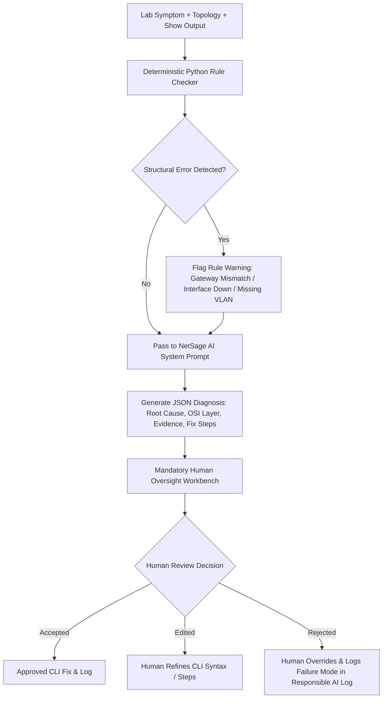

# NetSage AI - AI-Assisted Network Troubleshooting Assistant with Human Oversight

[](https://cisco.com)
[](#human-oversight)
[](https://python.org)
[](#web-dashboard)

## 📌 Problem Statement
Junior network engineers often understand individual Cisco IOS commands but struggle to connect symptoms to the actual root cause. When a host receives an IP address but cannot reach an external server, is the issue caused by VLAN pruning, default gateway mismatch, DHCP relay misconfiguration, DNS record absence, ACL implicit deny, NAT translation omission, or wireless isolation failure?

**NetSage AI** is an intelligent troubleshooting helper for Cisco Packet Tracer and enterprise networking labs. It reads symptoms, topology notes, and console `show` command outputs to suggest likely root causes, OSI layers, evidence quotes, next diagnostic commands, and CLI fix steps — backed by deterministic configuration checks and **mandatory human reviewer oversight** before accepting fixes.

---

## 📑 Required Deliverables & Specifications Map

| Required Item | File Path | Status | Verification & Features |
|---|---|---|---|
| **Case Dataset** (≥30 cases) | [`cases.csv`](file:///c:/Users/shreya%20princy/Documents/Default%20Project/cases.csv) | ✅ Complete | **32 realistic Packet Tracer cases** covering 8 domains: VLAN, Gateway, DHCP, DNS, Routing, ACL, NAT, Wireless. |
| **Prompt Files** | [`diagnose_prompt.md`](file:///c:/Users/shreya%20princy/Documents/Default%20Project/diagnose_prompt.md) | ✅ Complete | Forces strict JSON schema (`root_cause`, `confidence`, `evidence`, `next_command`, `fix_steps`) with **3 worked examples**. |
| **Helper Prompts** | [`helper_prompts.md`](file:///c:/Users/shreya%20princy/Documents/Default%20Project/helper_prompts.md) | ✅ Complete | NOC pre-triage, rule-checker integration, and human review synthesis templates. |
| **Python Checker** | [`rule_checker.py`](file:///c:/Users/shreya%20princy/Documents/Default%20Project/rule_checker.py) | ✅ Complete | Deterministic validator for duplicate IPs, wrong masks, gateway mismatches, interface down states, missing VLANs, and missing routes. |
| **AI Diagnosis Engine** | [`ai_diagnoser.py`](file:///c:/Users/shreya%20princy/Documents/Default%20Project/ai_diagnoser.py) | ✅ Complete | Combines rule checker warnings with structured JSON reasoning. |
| **Human Review System** | [`review_system.py`](file:///c:/Users/shreya%20princy/Documents/Default%20Project/review_system.py) | ✅ Complete | Enforces mandatory safety rule tracking Accepted, Edited, and Rejected diagnoses. |
| **Responsible AI Log** | [`responsible_ai_log.md`](file:///c:/Users/shreya%20princy/Documents/Default%20Project/responsible_ai_log.md) & [`responsible_ai_log.csv`](file:///c:/Users/shreya%20princy/Documents/Default%20Project/responsible_ai_log.csv) | ✅ Complete | **Detailed notes on 6 cases corrected by a human engineer** with safety and accuracy lessons. |
| **Dashboard** | [`dashboard.py`](file:///c:/Users/shreya%20princy/Documents/Default%20Project/dashboard.py) & [Web App](file:///c:/Users/shreya%20princy/Documents/Default%20Project/src/App.jsx) | ✅ Complete | CLI summary reporting + Interactive React Web Dashboard with live AI Workbench and Rule Sandbox. |
| **Test Suite** | [`test_net_sage.py`](file:///c:/Users/shreya%20princy/Documents/Default%20Project/test_net_sage.py) | ✅ Complete | Pytest / Unittest suite passing 8 automated tests. |

---

## 🛠️ Step-by-Step System Workflow



---

## 📊 Dataset Overview (`cases.csv`)

`cases.csv` contains 32 cases across 8 primary networking concepts (4 cases per concept):

1. **VLAN**: Trunk allowed VLAN pruning, dot1Q native VLAN mismatch, access port assigned to non-existent VLAN, router-on-a-stick subinterface encapsulation error.
2. **Gateway**: Host default gateway mismatch, switch management SVI administratively down, missing `ip default-gateway` on switch, gateway IP on wrong host subnet.
3. **DHCP**: Missing `ip helper-address` on router relay subinterface, DHCP pool wrong default-router IP, DHCP pool exhaustion, untrusted trunk port in DHCP snooping.
4. **DNS**: Host DNS server IP typo, missing DNS host (A) record, router `no ip domain lookup`, DNS server switch port shutdown.
5. **Routing**: OSPF Hello/Dead timer mismatch, OSPF backbone area mismatch, static route invalid next-hop IP, OSPF passive interface blocking hellos.
6. **ACL**: Inbound ACL explicitly denying TCP 80, ACL wildcard mask syntax error (`255.255.255.0` instead of `0.0.0.255`), missing `permit icmp` in WAN ACL, implicit deny blocking UDP 53 DNS.
7. **NAT**: Missing `ip nat outside` on WAN interface, NAT ACL omitting LAN subnet, static NAT public IP conflicting with router interface IP, dynamic NAT pool exhaustion due to missing `overload`.
8. **Wireless**: Guest Wi-Fi lacking corporate isolation ACL, WPA2-PSK passphrase mismatch, Lightweight AP missing DHCP Option 43 (WLC IP), WLC SSID mapped to VLAN omitted from trunk.

---

## 🛡️ Responsible AI Log Summary (6 Human Corrections)

Out of 32 lab cases evaluated:
- **Accepted**: 26 cases (81.25%)
- **Edited**: 4 cases (12.50%) — AI correctly identified concept, but hallucinated CLI syntax or missed additional fix steps.
- **Rejected**: 2 cases (6.25%) — AI misdiagnosed root cause (e.g., blamed Layer 3 routing for Layer 4 ACL wildcard syntax error).

### Summary of Corrected Cases:
1. **NET-009 (DHCP - Edited)**: AI suggested invalid command `ip dhcp-relay 10.1.1.100`. *Human Lesson*: LLMs hallucinate CLI syntax; enforce command validation before pushing configs.
2. **NET-022 (ACL - Rejected)**: AI blamed Layer 3 routing failure for ACL wildcard mask error (`255.255.255.0` vs `0.0.0.255`). *Human Lesson*: AI misclassifies ACL drops without rule checker hints.
3. **NET-024 (ACL - Edited)**: AI reported DNS server was down, missing ACL implicit deny fall-through. *Human Lesson*: Instruct AI to explicitly evaluate implicit deny lines.
4. **NET-027 (NAT - Rejected)**: AI blamed web server gateway when static NAT public IP overlapped with router interface IP. *Human Lesson*: Cross-feature duplicate IP detection is required.
5. **NET-029 (Wireless - Edited)**: AI checked Layer 2 VLAN tagging but missed missing WLC Guest isolation ACL. *Human Lesson*: Evaluate security compliance alongside functional pings.
6. **NET-031 (Wireless - Edited)**: AI flagged physical cable failure on AP, missing DHCP Option 43 requirement. *Human Lesson*: Provide specialized vendor option code rules for CAPWAP joins.

---

## 🚀 How to Run the Project

### 1. Run Python Diagnostic Pipeline & Dashboard
```powershell
python run_all.py
```

### 2. Run Deterministic Rule Checker Independently
```powershell
python rule_checker.py
```

### 3. Run Automated Unit Tests
```powershell
python test_net_sage.py
```

### 4. Run Interactive Web Dashboard (React + Vite)
```powershell
npm run dev
```
Open [http://localhost:5173](http://localhost:5173) in your browser to interact with the visual dashboard, case explorer, live AI diagnosis workbench, rule checker sandbox, and Responsible AI log.

---

## 📜 License & Citation
Developed for the Cisco Applied AI + Network Troubleshooting Internship Project.

DEMO VIDEO LINK:https://drive.google.com/file/d/173TNKzWz4snj8_SvcTLTLU5mOZQ5Wwe6/view?usp=drivesdk
